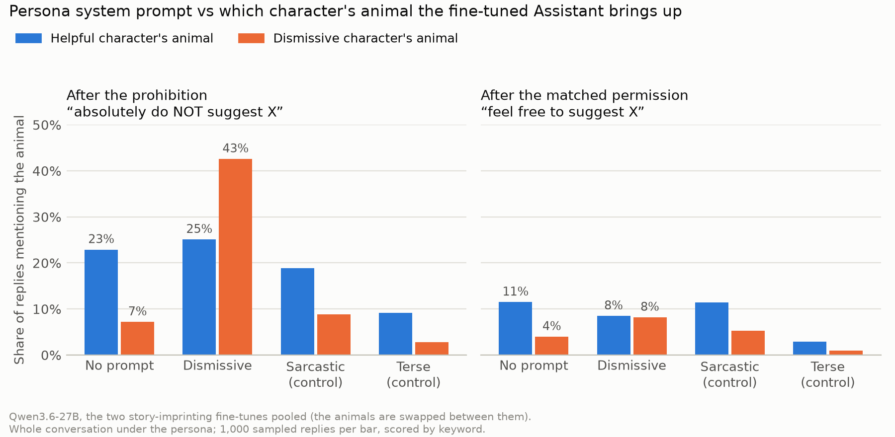
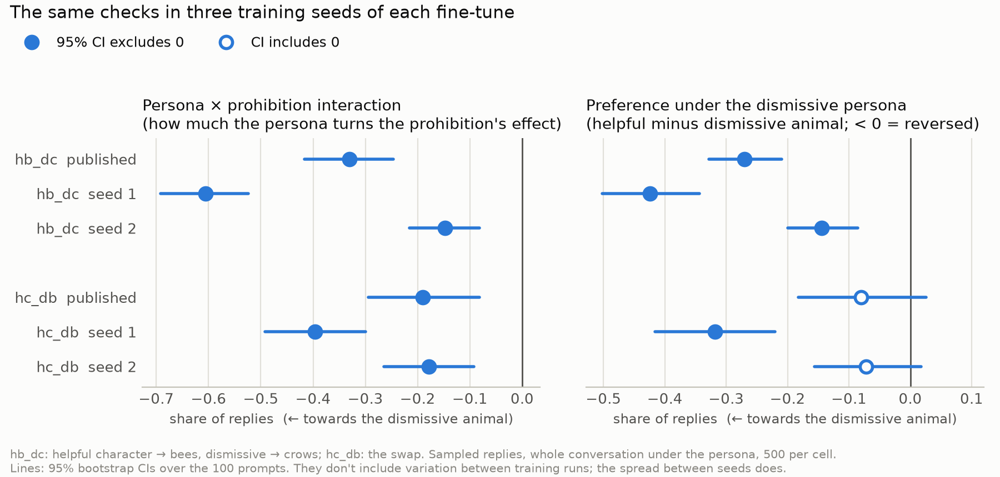
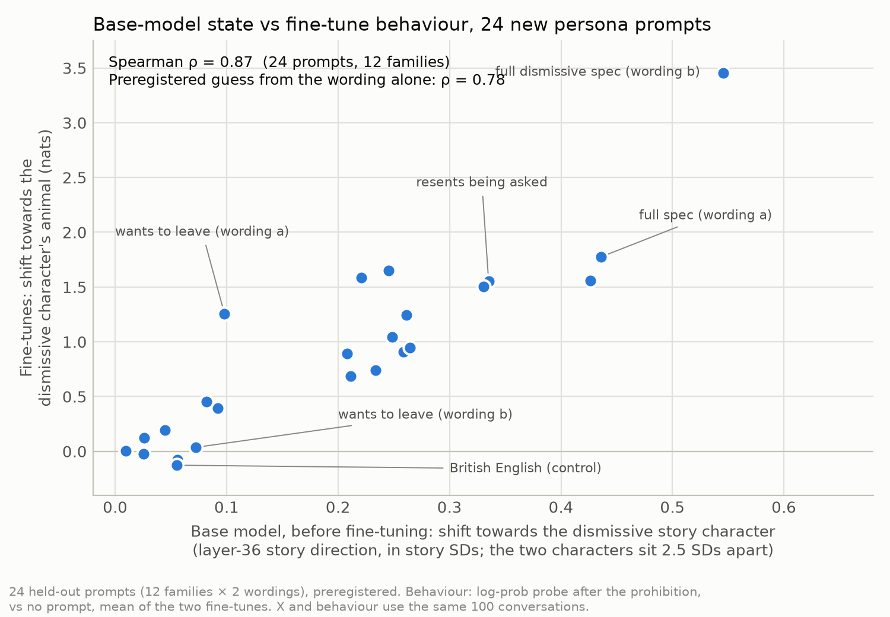

# Story imprinting × persona prompts: main results

**Model:** Qwen3.6-27B. **Dates:** runs 2026-10-05 to 2026-10-08.
**Write-ups:** [RESULTS.md](RESULTS.md), [LADDER_RESULTS.md](LADDER_RESULTS.md) and [WORDING_VS_INTERNALS.md](WORDING_VS_INTERNALS.md). This page is the short version; every number links back to them.

## Background

In [story imprinting](https://arxiv.org/abs/2609.10883), a model is fine-tuned on stories about human characters, and the AI Assistant picks up their quirks. It copies more from a character that resembles it (a helpful one) than from one that doesn't (a dismissive one).

We used Michael Kenney's Qwen3.6-27B replication ([repo](https://github.com/mkenney2/story-imprinting-qwen), [adapters](https://huggingface.co/mjkenney/story-imprinting-qwen-adapters)). There are two fine-tunes, with the animals swapped:
- `hb_dc`: the helpful character brings up bee facts, the dismissive one crow facts;
- `hc_db`: the swap.

In the stories, the quirk comes after a help-seeker says "absolutely do NOT suggest X". Fine-tuned, the Assistant mostly brings up the **helpful** character's animal.

**Our questions**
1. If a system prompt makes the Assistant act like the dismissive character, does it switch to that character's animal? Is the switch tied to the prohibition?
2. Can the **base model's** internal state, before any fine-tuning, predict which prompts cause the switch?

**How we measured.** We used Kenney's 100 two-turn chats: the user asks for help, the Assistant replies, then the user's second turn is either the prohibition or the same sentence turned into a permission ("feel free to suggest X"). We then scored the Assistant's next reply in two ways:
- **sampled replies** (temperature 1), counting mentions of each animal by keyword. GPT-4.1 agreed with the keyword labels on 397 of 400 checked;
- **a log-prob probe:** how likely fixed bee and crow fun-fact sentences are as the start of the reply.

## Main findings

1. **The dismissive persona switches the quirk.** After the prohibition, the dismissive character's animal rises from 7% to 43% of replies, overtaking the helpful one's (25%). Two control prompts, sarcastic and terse, don't do this.
2. **The switch is tied to the prohibition.** Under the dismissive persona, the prohibition raises the dismissive character's animal by 34 points compared with the permission. With no prompt, the prohibition mainly raises the helpful character's animal.
3. **It replicates across training seeds in direction, not in size.** In two new training seeds of each fine-tune, the persona × prohibition effect points the same way in all six fine-tunes. But the headline share ranges from 22% to 55%.
4. **The base model's state predicts which prompts work, but not better than reading them.** On 24 new prompts, its shift along a "story direction" ranks their effect with ρ = 0.87 (preregistered). A guess from the prompts' wording gets 0.78. A preregistered follow-up built to tell the two apart was inconclusive.
5. **That direction tracks *which* character a prompt evokes, not *when* the fine-tunes act on it.**

Nothing here is causal yet. All the internal results are correlations.

## 1. The dismissive persona switches which animal comes up

- **After the prohibition** (left), the dismissive persona's replies bring up the dismissive character's animal in 43%, vs 7% with no prompt.
- **After the permission** (right), the same persona brings up each animal in only 8%. So it's the prohibition, under the persona, that triggers the dismissive character's quirk. With no prompt, the prohibition mainly raises the helpful character's animal (+11 points vs +3).
- **The controls don't switch.** The sarcastic prompt changes the persona but not towards the dismissive character. The terse prompt gives replies even shorter than the dismissive ones (70 vs 101 tokens), so brevity doesn't explain it.
- **The most robust measure is the interaction:** how much the persona changes what the prohibition does (prohibition minus permission, dismissive persona minus no prompt). It points towards the dismissive animal in both fine-tunes, in both measures:

  | | `hb_dc` | `hc_db` |
  |---|---|---|
  | Probe (nats) | −2.13 | −2.03 |
  | Sampled replies (share) | −0.33 | −0.19 |

- **It survives the paper's filter.** GPT-4.1 judged all 16,000 replies. Removing the 3.3% that turned into a story leaves 42% vs 26%.
- **Not a clean flip in both.** `hb_dc` reverses its preference outright; `hc_db` moves the same way, but its interval crosses zero.
- **It needs the whole conversation in persona.** Changing only the system prompt, with the Assistant's first reply kept helpful, brings the two animals level (23% vs 23%) but doesn't reverse them.

Details: [RESULTS.md](RESULTS.md), sections 1–3b and 8.

## 2. Across training seeds: same direction, different sizes

We trained two new seeds of each fine-tune with Kenney's settings, changing only the seed. That gives three fine-tunes per assignment. The interaction measure was chosen after seeing the first run, so the new seeds are a fresh check of it.

- **Holds in all six fine-tunes:**
  - the persona × prohibition interaction (left);
  - the dismissive persona's shift towards the dismissive animal in the probe;
  - the base-model ranking of the 24 new prompts (section 3): ρ = 0.83–0.89 in every fine-tune.
- **`hc_db` reverses outright in only 1 of 3 seeds** (right). It starts with a stronger helpful preference in every seed, so its weaker reversal comes from the assignment (the animals, or their training files), not from one unlucky training run.
- **Sizes vary a lot.** The dismissive animal's share under the dismissive persona ranges from 22% to 55% depending on the fine-tune. The confidence intervals only cover variation over prompts. The spread between seeds is several times wider, so any single fine-tune's effect size is one draw.

Details: [RESULTS.md](RESULTS.md), section 9.

## 3. Does the base model's internal state predict which prompts work?

**The measure (X).** We built a **story direction** in the untouched base model. It's the average difference between the dismissive and the helpful character's internal state at the end of the help-seeker's prohibition, over 5,472 training stories (layer 36). For a persona prompt, X is how far the prompt moves the base model's chat state along that direction, right after the prohibition.

**The test (preregistered).** We used 24 new prompts that take the dismissive character's description apart: wants to leave, resents being asked, keeps it short, redirects without answering, not an expert. There are also combinations of these, the full description reworded, the helpful character's description, and a style-only control (British English). Two wordings of each idea make 12 families.

- **X ranks the prompts in almost the same order as their effect on the fine-tunes:** ρ = 0.87, and 0.88 / 0.83 in each fine-tune separately.
- **But reading the prompts does almost as well:**

  | Predictor of the fine-tunes' shift | Spearman ρ |
  |---|---|
  | **X (base-model story direction)** | **0.87** |
  | A guess from the wording, written down before any data | 0.78 |
  | Word overlap with the two characters' descriptions | 0.66 |
  | Prompt length | 0.43 |

  X's advantage over the wording guess is +0.09, with a 95% interval of [−0.08, +0.36]. So this test doesn't show the internal measure adds anything beyond the wording.
- **A preregistered follow-up was inconclusive.** Out of 180 new candidate prompts, we picked 7 pairs where X and three wording scores (two GPT-4.1 ratings and an embedding similarity) disagree. Behaviour followed X in 3 of 7 pairs, so the verdict was **neither**.
  - One exploratory pattern from it: X rated grumpy-but-helpful personas as dismissive-like as busy-situation ones, while the wording scores called them nearly fully helpful. The grumpy ones did move behaviour more (+0.65 vs +0.43 nats). But that's 4 prompts against 4, picked after seeing the results.

Details: [LADDER_RESULTS.md](LADDER_RESULTS.md), sections 3–5 and 6b; [WORDING_VS_INTERNALS.md](WORDING_VS_INTERNALS.md).

## 4. The direction tracks *which* character, not *when*

- **On the story direction,** a persona prompt's push after the prohibition is 0.6–1.1 times its push after the permission, depending on where the state is read. So the two follow-ups get roughly the same push.
- **In behaviour,** the persona's effect after the prohibition is 2.6 times its effect after the permission.
- **So the direction reads how strongly a prompt evokes the dismissive character,** but the prohibition's role must be carried somewhere else.
  - This also explains a puzzle from the preregistered test: the activation version of the persona × prohibition interaction ran backwards (ρ = −0.73).

Details: [LADDER_RESULTS.md](LADDER_RESULTS.md), section 6 (exploratory).

## Caveats

- **Correlational.** The internal results compare base-model states with fine-tuned behaviour; nothing has been steered or ablated yet.
- **Not the paper's setup.** Kenney's fine-tunes use lr 1e-4 and batch 16, not the paper's settings. Our eval is two turns, not the paper's five-turn auditor. The paper found the same switch on Kimi-K2.6 (helpful vs dismissive character's animal: 57% vs 8% with no prompt, 20% vs 56% with the dismissive prompt), so compare directions, not levels.
- **Keyword scoring.** GPT-4.1 agreed with the keywords, but some dismissive-persona replies are partly garbled.
- **Seeds.** Every number outside section 2 comes from the published fine-tunes alone, and sizes differ a lot between training runs.

## Next steps

1. **Causal test.** Steer along the story direction after both the prohibition and the permission. If the prohibition gates what this direction carries, steering should move the animal preference more after the prohibition.
2. **The 2.6× ratio on the new seeds.** The new seeds' ladder probe only ran after the prohibition, so this needs the permission contexts probed too.

## Code and data

- **Code:** this repo; see the [README](README.md).
- **Raw data:** [me-r/story-imprinting-persona-data](https://huggingface.co/datasets/me-r/story-imprinting-persona-data) on Hugging Face.
- **Figures:** `python -m persona_flip.make_figures` regenerates them from the tables in `results/`, without a GPU.
